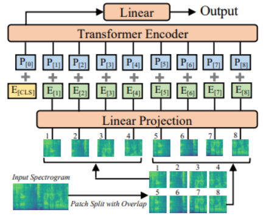
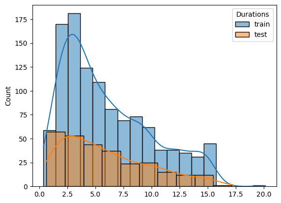
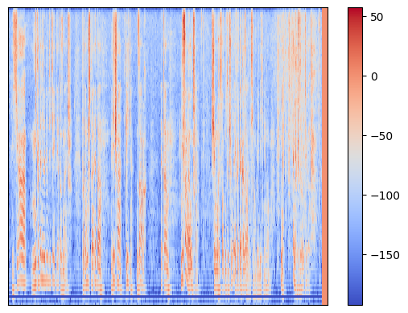

# spectrogram soul
Audio sentiment classification wrapped in tg bot.

model: Audio Spectragram Transformer - [paper](https://arxiv.org/abs/2104.01778), [model page](https://huggingface.co/abletobetable/spec_soul_ast)

model trained on [dataset](https://huggingface.co/datasets/Aniemore/resd) - [model_ page](https://huggingface.co/abletobetable/spec_soul_ast)

## AST architecture:



## EDA:





## Audio augmentations:

AddGaussianNoise(
    min_amplitude=0.001, max_amplitude=0.005, p=0.5)

TimeStretch(
    min_rate=0.95, max_rate=1.05, p=0.5)

PitchShift(
    min_semitones=-1, max_semitones=1, p=0.5)

Shift(
    min_fraction=-0.5, max_fraction=0.5, p=0.5)

TimeMask(
    min_band_part=0.01, max_band_part=0.1, fade=True, p=0.5)

## Train:

0. just AST: accuracy = 0.60 ([my model](https://huggingface.co/abletobetable/spec_soul_ast))

1.1. get text with Whisper over audios than [rubert tiny ](https://huggingface.co/cointegrated/rubert-tiny2-cedr-emotion-detection) features
1.2. concat features and classification head:

1.3. head
KNN:
{'n_neighbors': 2, 'p': 2, 'weights': 'uniform'}
accuracy = 0.59

logreg:
{'solver': 'newton-cholesky', 'C': 75}
0.625

SVM:
{'kernel': 'linear', 'C': 20}
0.6107142857142858

## Results:
              precision    recall  f1-score   support

           0       0.76      0.84      0.80        44
           1       0.56      0.62      0.59        37
           2       0.57      0.57      0.57        40
           3       0.68      0.67      0.67        45
           4       0.60      0.57      0.58        44
           5       0.50      0.55      0.53        38
           6       0.73      0.50      0.59        32

    accuracy                            0.62       280
    macro avg       0.63      0.62      0.62       280
    weighted avg    0.63      0.62      0.62       280

# neuroBot

Bot that will be used as API for NeuroNet that can estimate emotional background of voice message

## Getting Started

- Create virtual environment for Python3.10:

```sh
python3.10 -m venv .venv
```

- For VS Code users: Select Interpreter

- Install dependencies with `poetry`:

```sh
poetry install
```

- After installing dependencies we recommend updating their versions:

```sh
poetry update
```

- To add package or make package production one (packages for data science are
  in `dev` section) use:

```sh
poetry add <package>
```

- More about Poetry commands you can read on their [documentation
  page](https://python-poetry.org/docs/cli/).

- Do not forget to initialize `pre-commit` after installing dependencies:

```sh
pre-commit install --hook-type pre-commit --hook-type pre-push
```

- Add file in source dir with name .env :

```sh
.env
```

Add AIOGRAM_API_TOKEN variable to .env file:

```sh
AIOGRAM_API_TOKEN = {YOUR_SUPER_SECRET_TOKEN}
```

- To start bot https://t.me/xkm555_bot:

```sh
python emo_service/api/bot_run.py
```
